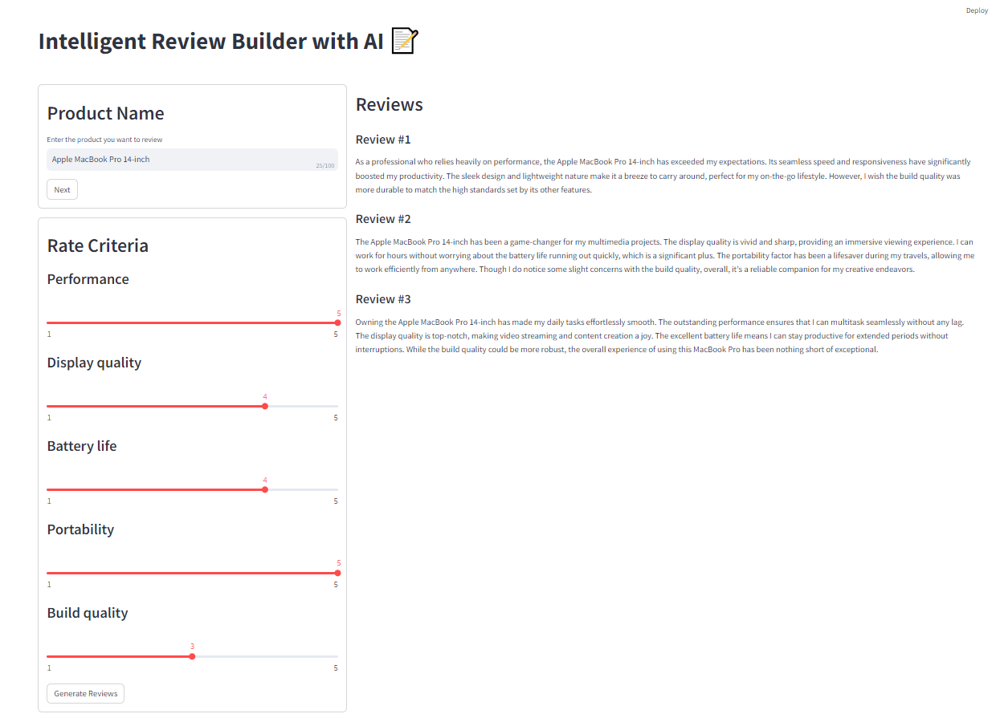

# Intelligent Review Builder with AI

This project serves as the frontend for the Intelligent Review Builder with AI.

## Application Workflow

1. **User Input - Product Name**:
   - The user begins by providing a title or description of the product they wish to review.

2. **Generate Rating Criteria**:
   - Based on the provided product description, the application generates a list of criteria for rating.

3. **User Input - Rating Criteria**:
   - The user then rates the product based on the generated criteria.

4. **Generate Reviews**:
   - Using the rated criteria, the application produces 3 possible reviews for the product.

This streamlined process leverages AI to assist users in crafting comprehensive and insightful product reviews.

repository for source codes: [review-builder](https://github.com/Shahab89/review_builder.git).
